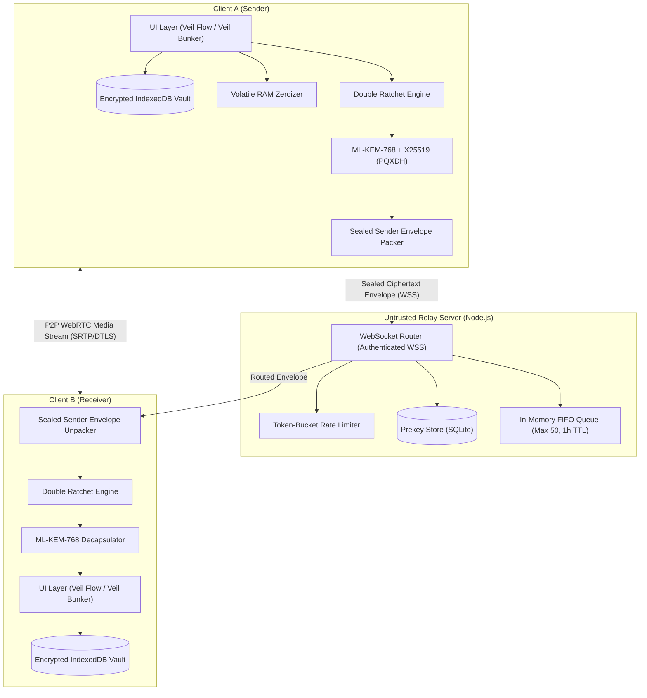
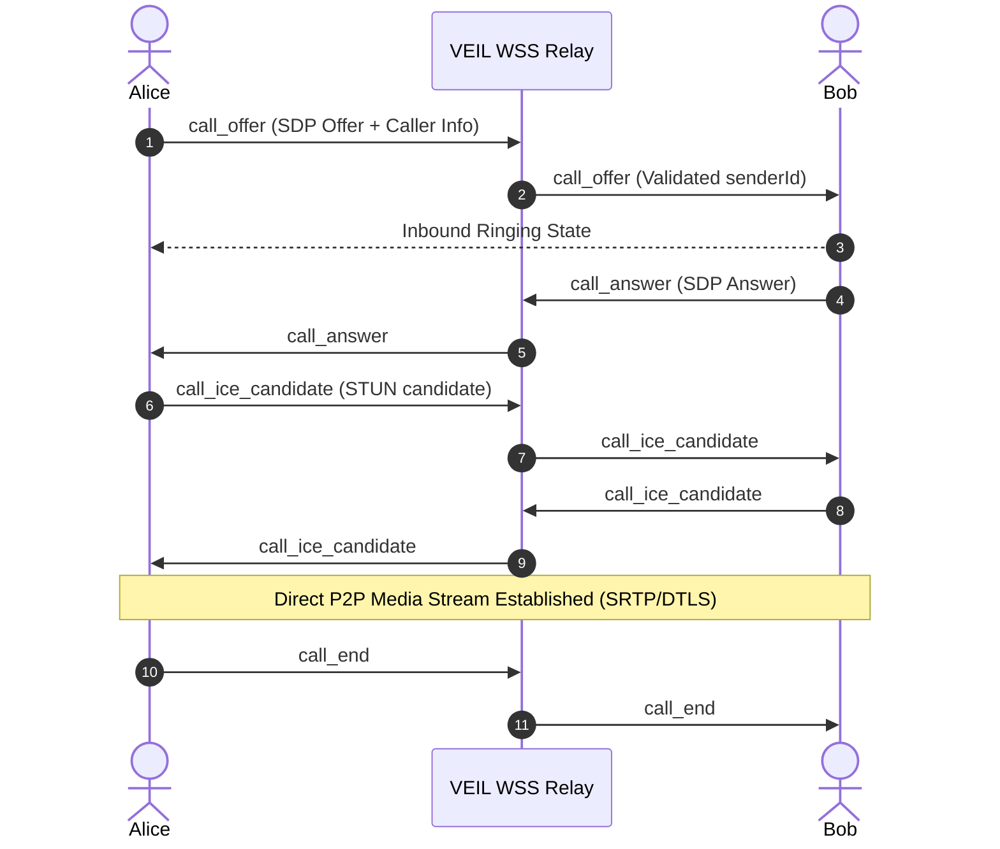

# Project VEIL — Technical Architecture Document

**Version:** 2.0.0-PROD  
**System Classification:** Post-Quantum Zero-Knowledge Secure Communication Platform  

---

## 1. High-Level System Architecture

Project VEIL operates on a zero-knowledge, client-side heavy architecture. The server acts exclusively as an untrusted, stateless routing relay and prekey repository. All key encapsulation, identity verification, message encryption, ratchet ratcheting, media ciphering, and data persistence take place strictly on user endpoints.



---

## 2. End-to-End Cryptographic Protocol Stack

```
┌────────────────────────────────────────────────────────┐
│                   Application Layer                    │
│      (Text, Voice Memos, Polls, Reactions, Edits)      │
├────────────────────────────────────────────────────────┤
│           Double Ratchet (Forward Secrecy)             │
│        (DH Ratchet + Root / Send / Recv Chains)        │
├────────────────────────────────────────────────────────┤
│     Post-Quantum Extended Triple Diffie-Hellman        │
│          ML-KEM-768 (Kyber) + Curve25519 (X3DH)        │
├────────────────────────────────────────────────────────┤
│          Sealed Sender Envelope Blinding               │
│       (Ed25519 Server Certificates + Delivery Tokens)  │
├────────────────────────────────────────────────────────┤
│         Symmetric Encryption: AES-256-GCM              │
│            Strict 96-bit IVs + Authenticated AAD       │
└────────────────────────────────────────────────────────┘
```

### 2.1 Hybrid Post-Quantum Key Agreement (PQXDH)
When Alice initiates a session with Bob:
1. Alice fetches Bob's signed prekey bundle from the relay:
   - Identity Keys: $IK_{bob}^{X25519}$, $IK_{bob}^{Ed25519}$
   - Signed Prekey: $SPK_{bob}^{X25519}$ (verified against $IK_{bob}^{Ed25519}$)
   - One-Time Prekey: $OPK_{bob}^{X25519}$ (if available)
   - Post-Quantum Prekey: $PQPK_{bob}^{ML-KEM-768}$
2. Alice generates ephemeral keypair: $EK_{alice}^{X25519}$
3. Alice encapsulates a shared secret using Bob's quantum public key:
   $$(SS_{pq}, CT_{pq}) \leftarrow \text{Encaps}(PQPK_{bob}^{ML-KEM-768})$$
4. Alice computes classical Diffie-Hellman values:
   $$DH_1 = \text{X25519}(IK_{alice}, SPK_{bob})$$
   $$DH_2 = \text{X25519}(EK_{alice}, IK_{bob})$$
   $$DH_3 = \text{X25519}(EK_{alice}, SPK_{bob})$$
   $$DH_4 = \text{X25519}(EK_{alice}, OPK_{bob}) \quad \text{(if OPK present)}$$
5. The combined master secret is derived via HKDF-SHA256:
   $$SK = \text{HKDF-Extract}(\text{Salt}, DH_1 \mathbin{\Vert} DH_2 \mathbin{\Vert} DH_3 \mathbin{\Vert} DH_4 \mathbin{\Vert} SS_{pq})$$
   $$RootKey, ChainKey_{send} \leftarrow \text{HKDF-Expand}(SK, \text{"VEIL_PQXDH_V1"}, 64)$$

### 2.2 The Double Ratchet Algorithm
Once the root key is established:
- **KDF Chain Ratchet (Symmetric):** Each sent/received message advances the sending/receiving symmetric chain via HKDF, generating a unique, single-use message key.
- **Diffie-Hellman Ratchet (Asymmetric):** Whenever a turn completes, a new X25519 ephemeral key is generated and exchanged in the message header. This advances the root key chain, guaranteeing **Post-Compromise Security (PCS)**.
- **Out-of-Order Message Handling:** Skipped message keys are stored temporarily in IndexedDB with an expiration TTL to permit out-of-order decryption before being zeroized.

### 2.3 Sealed Sender Protocol
To prevent the relay server from mapping the communication social graph:
1. Bob generates an encrypted **Delivery Token** and shares it with Alice during mutual handshake.
2. When Alice sends a message, she wraps it in two cryptographic layers:
   - **Inner Envelope:** Contains Alice's sender identity, sender Ed25519 certificate, timestamp, and message ciphertext, encrypted under Bob's ratchet key.
   - **Outer Envelope:** Addressed only to `to: Bob_ID` with `deliveryToken: Token`. Alice's identity `from` is completely stripped.
3. The server validates the delivery token without knowing who sent the packet, routing it to Bob blindly.

---

## 3. WebRTC Audio & Video Calling Architecture

Project VEIL implements browser-native, end-to-end encrypted WebRTC calling without intermediaries:



- **Signaling Security:** Every call signaling message (`call_offer`, `call_answer`, etc.) is validated by the server against the active authenticated WebSocket connection (`connectionMap.get(ws) === from`), preventing call spoofing or impersonation.
- **Media Encryption:** Browser-enforced DTLS-SRTP encryption handles media packet transmission. If direct NAT traversal fails, Google STUN (`stun.l.google.com:19302`) provides reflexive candidate gathering.

---

## 4. Client-Side Vault & Storage Architecture

### 4.1 Data-at-Rest Encryption (`db.js`)
All local records persisted to IndexedDB (`veil_crypto_store`) are automatically encrypted under the user's master key derived from PBKDF2:

```
[Plaintext Message]
       │
       ▼
[packMessageForStorage()]
       │
       ├─ Sensitive Payload: { text, attachment, replyTo, poll, reactions, edited, viewOnce, viewed }
       ▼
[AES-256-GCM Encryption] (Unique 96-bit IV)
       │
       ▼
[Stored IndexedDB Document]
 {
   contactId: "...",
   seq: 1727548900123,
   fromMe: true,
   ts: 1727548900123,
   __enc: true,
   encPayload: { iv: "...", ciphertext: "..." }
 }
```

### 4.2 Ephemeral "View Once" Pipeline
View Once media files bypass permanent storage entirely:
1. Media ciphertext is downloaded from the relay server attachment cache.
2. Decrypted into RAM using WebCrypto API.
3. Rendered inside a React modal via `URL.createObjectURL(blob)`.
4. As soon as the modal is closed or unmounted:
   - `URL.revokeObjectURL(url)` is immediately invoked to release the buffer from RAM.
   - The stored message record is updated to `{ viewed: true, attachment: null }`.

---

## 5. Relay Server Architecture (`server/server.js`)

The VEIL relay server is designed as a zero-trust dumb router:
- **Stateless Operation:** No message contents or decrypted metadata are stored on disk.
- **In-Memory FIFO Routing:** If the target recipient is offline, encrypted envelopes are stored in a bounded FIFO queue (maximum 50 messages per identity) with a strict 1-hour time-to-live (TTL).
- **SQLite Prekey Pool:** Stores encrypted prekey bundles (`identity_keys`, `prekeys`, `sender_certs`). Prekeys are removed as soon as they are consumed (one-time prekey replenishment).
- **Rate Limiting:** Token-bucket rate limiting enforces maximum 30 connection attempts per minute and 100 WebSocket messages per minute per IP address.
- **Strict Headers:** Configured with Content-Security-Policy (CSP), `X-Content-Type-Options: nosniff`, and strict CORS headers preventing unauthorized cross-origin requests.

---

## 6. Mobile Platform Integration (Android Capacitor)

- **`FLAG_SECURE` Protection:** Prevents operating system screen capture, video recording, and recent task switcher caching of sensitive messages.
- **Biometric Authentication:** Uses `capacitor-secure-storage-plugin` to protect the master passphrase behind native Android Fingerprint / BiometricPrompt APIs.
- **Local Assets:** Packaged directly into `android/app/src/main/assets/public/` using `npx cap copy` for zero network dependency when loading core application UI.
